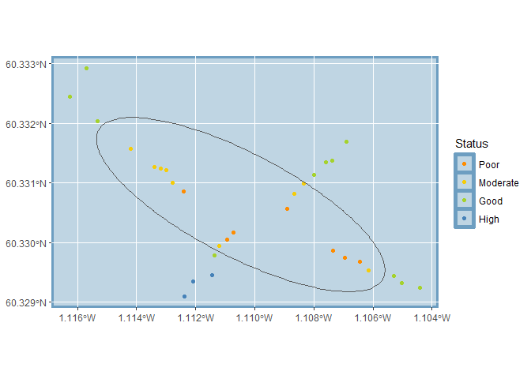

<!-- README.md is generated from README.Rmd. Please edit that file -->

# kraken

<!-- badges: start -->

[](https://github.com/aquaMetrics/kraken/actions/workflows/R-CMD-check.yaml)
[](https://lifecycle.r-lib.org/articles/stages.html#experimental)
[](https://app.codecov.io/gh/aquaMetrics/kraken?branch=main)
<!-- badges: end -->

The goal of `kraken` [R](https://www.r-project.org/) package is to
calculate the mixing zone area from Fauna IQI or DNA predicted IQI
sampling results.

This package is in an experimental phase. The core algorithm for
calculating the area is unlikely to change, but the function names as
well as the data formats and structures may change.

## Installation

You can install the development version of `kraken` like so:

``` r
install.packages("devtools")
devtools::install_github("aquaMetrics/kraken")
```

## Calculate Area

``` r
library(kraken)
```

Example shows how to calculate mixing zone and all relevant outputs.

``` r
output <- kraken(demo_iqi)
head(output)
```

    #> # A tibble: 6 × 8
    #>   project_id location_id sample_id date_taken question response object parameter
    #>   <chr>      <chr>       <chr>     <date>     <chr>    <chr>    <list> <chr>    
    #> 1 Bellister… Bellister1… 1NABelli… NA         station… Complia… <NULL> benthic …
    #> 2 Bellister… Bellister1… 1NABelli… NA         twoCons… Complia… <NULL> benthic …
    #> 3 Bellister… Bellister2… 2NABelli… NA         station… Complia… <NULL> benthic …
    #> 4 Bellister… Bellister2… 2NABelli… NA         twoCons… Complia… <NULL> benthic …
    #> 5 Bellister… Bellister3… 3NABelli… NA         station… Complia… <NULL> benthic …
    #> 6 Bellister… Bellister3… 3NABelli… NA         twoCons… Complia… <NULL> benthic …

The outputs dataframe includes the overall predicted mixing zone area
(ellipse) with 95% confidence as well as related warnings if applicable.

``` r
# area_95 provides the output 
output$response[output$question == "area_95_confidence"]
#> [1] "96914.9237670089"
```

``` r
output$response[output$question == "area_warning"]
#> [1] NA
output$response[output$question == "ellipse_warnings"]
#> [1] NA
```

The outputs also include a map of the stations and including the
indicative ellipse area:

``` r
output$object[output$question == "map"]
#> [[1]]
```



Save indicative ellipse area as shapefile:

``` r
ellipse <- output$object[output$question == "ellipse"][[1]]
sf::write_sf(ellipse[[1]],"ellipse.shp")
```

Other lower-level functions are provided to run specific parts of the
validation and calculation process.

## Help

View documentation for each function in the usual way.

``` r
?kraken
?consecutive_stations
# ...
```
